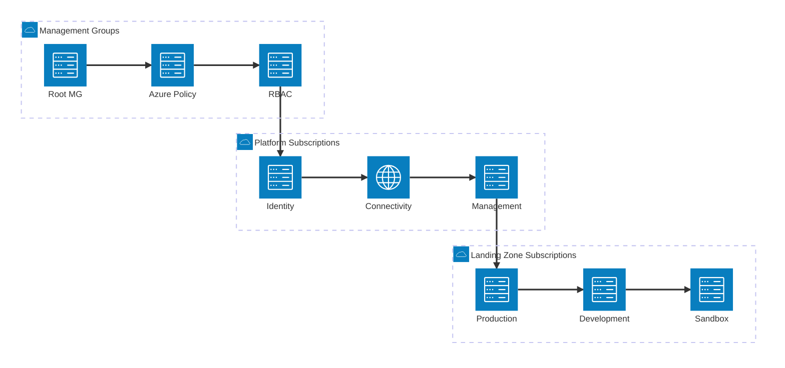

# Azure Cloud Migration Reference Architecture

## Overview

This document provides high-level reference architectures for migrating on-premises workloads to Microsoft Azure. These architectures follow Azure best practices and are designed to support secure, scalable, and cost-effective cloud migration.

## Table of Contents

1. [High-Level Migration Architecture](#high-level-migration-architecture)
2. [Hub-and-Spoke Network Topology](#hub-and-spoke-network-topology)
3. [Azure Landing Zone Architecture](#azure-landing-zone-architecture)
4. [Migration Execution Architecture](#migration-execution-architecture)
5. [Data Migration Architecture](#data-migration-architecture)
6. [Security and Governance Architecture](#security-and-governance-architecture)

---

## High-Level Migration Architecture

This architecture shows the complete migration ecosystem including on-premises infrastructure, Azure Migrate components, and target Azure environment.

**Key Components:**

- **On-Premises Environment**: Source infrastructure including VMware, Hyper-V, physical servers, and databases
- **Azure Migrate Appliance**: Lightweight discovery and assessment tool
- **Assessment Engine**: Analyzes readiness, sizing, and cost estimates
- **Replication Service**: Handles continuous data replication during migration
- **Azure Target Environment**: Destination cloud infrastructure

---

## Hub-and-Spoke Network Topology

This architecture demonstrates the recommended network topology for enterprise Azure deployments, providing centralized governance and security.

**Architecture Benefits:**

- **Centralized Security**: Firewall and security controls in hub
- **Isolation**: Workloads separated across spokes
- **Shared Services**: DNS, monitoring, and management in hub
- **Scalability**: Easy to add new spoke VNets
- **Cost Optimization**: Shared resources reduce duplication

---

## Azure Landing Zone Architecture

Azure Landing Zones provide the foundation for secure, compliant, and scalable Azure deployments.

**Core Components:**

- **Management Groups**: Hierarchical organization and governance
- **Azure Policy**: Automated compliance and standards enforcement
- **RBAC**: Role-based access control across subscriptions
- **Identity Subscription**: Centralized identity and access management
- **Connectivity Subscription**: Hub networking and hybrid connectivity
- **Management Subscription**: Monitoring, logging, and security operations
- **Landing Zone Subscriptions**: Application workload environments

---

## Migration Execution Architecture

This architecture shows the technical flow for executing server and application migrations using Azure Site Recovery and Azure Migrate.

**Migration Services:**

- **Azure Site Recovery (ASR)**: VM replication and migration
- **Database Migration Service (DMS)**: Database migration with minimal downtime
- **Azure Migrate**: Unified migration hub
- **Azure Monitor**: Performance and health monitoring
- **Azure Backup**: Backup and disaster recovery
- **Security Center**: Security posture management

---

## Data Migration Architecture

This architecture illustrates various data migration patterns for different scenarios and data volumes.

**Data Migration Methods:**

1. **Azure Data Box**: Offline migration for large datasets (TBs to PBs)
2. **ExpressRoute**: Private, high-bandwidth connection (50 Mbps to 100 Gbps)
3. **VPN Gateway**: Encrypted internet connection for smaller datasets
4. **Database Migration Service**: Online migration with minimal downtime

**Target Data Services:**

- **Blob Storage**: Unstructured data (files, backups, media)
- **Azure SQL Database**: Relational databases
- **Azure Files**: Lift-and-shift file shares
- **Cosmos DB**: Globally distributed NoSQL databases

---

## Security and Governance Architecture

This architecture demonstrates defense-in-depth security and comprehensive governance for migrated workloads.

**Security Layers:**

1. **Identity & Access Management**
   - Azure Entra ID (formerly Azure AD)
   - Multi-Factor Authentication (MFA)
   - Privileged Identity Management (PIM)
   - Role-Based Access Control (RBAC)

2. **Network Security**
   - Network Security Groups (NSG)
   - Azure Firewall
   - DDoS Protection
   - Web Application Firewall (WAF)

3. **Data Protection**
   - Encryption at rest and in transit
   - Azure Key Vault for secrets management
   - Azure Backup for business continuity

4. **Governance & Compliance**
   - Azure Policy for compliance automation
   - Cost Management + Billing
   - Microsoft Defender for Cloud
   - Microsoft Sentinel (SIEM)

---

## Architecture Principles

### 1. **Security First**
- Zero Trust security model
- Encryption by default
- Least privilege access
- Defense in depth

### 2. **High Availability**
- Multi-region deployment capability
- Availability Zones for redundancy
- Load balancing and auto-scaling
- Disaster recovery planning

### 3. **Scalability**
- Horizontal scaling with VM Scale Sets
- Auto-scaling based on metrics
- Elastic database pools
- CDN for global distribution

### 4. **Cost Optimization**
- Right-sizing VMs based on actual usage
- Reserved Instances for predictable workloads
- Azure Hybrid Benefit for existing licenses
- Storage tiering and lifecycle management

### 5. **Operational Excellence**
- Infrastructure as Code (Terraform, Bicep)
- CI/CD pipelines for deployments
- Centralized monitoring and logging
- Automated backup and patching

### 6. **Performance Efficiency**
- Proximity placement groups
- Premium storage for critical workloads
- Accelerated networking
- Application performance monitoring

---

## Next Steps

1. **Review Architecture Patterns**: Evaluate which architecture best fits your requirements
2. **Design Your Landing Zone**: Implement Azure Landing Zone framework
3. **Plan Network Topology**: Design hub-and-spoke or virtual WAN architecture
4. **Implement Security Controls**: Deploy identity, network, and data security
5. **Set Up Governance**: Configure Azure Policy and management groups
6. **Execute Pilot Migration**: Test with non-critical workload
7. **Monitor and Optimize**: Continuously improve based on metrics

---

## Related Documentation

- [Migration Phases](./01-discovery-phase.md)
- [Security Best Practices](./best-practices.md)
- [Sequence Diagrams](./sequence-diagrams.md)
- [Azure MCP Tools Guide](./azure-mcp-migration-tools.md)

---

**Document Version**: 1.0  
**Last Updated**: November 12, 2025  
**Architecture Standard**: Azure Well-Architected Framework
