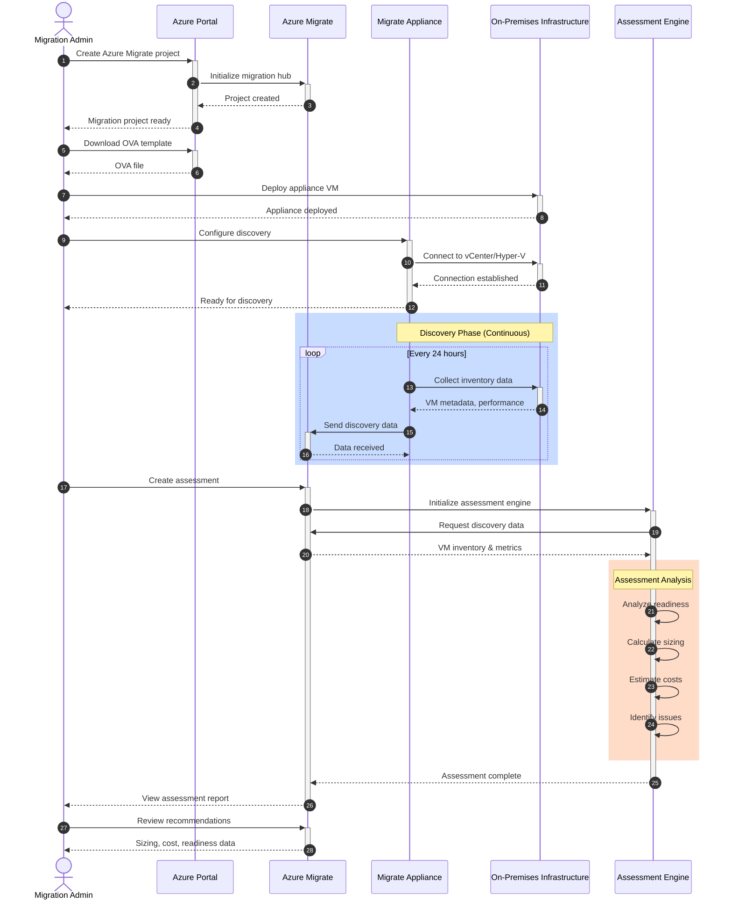
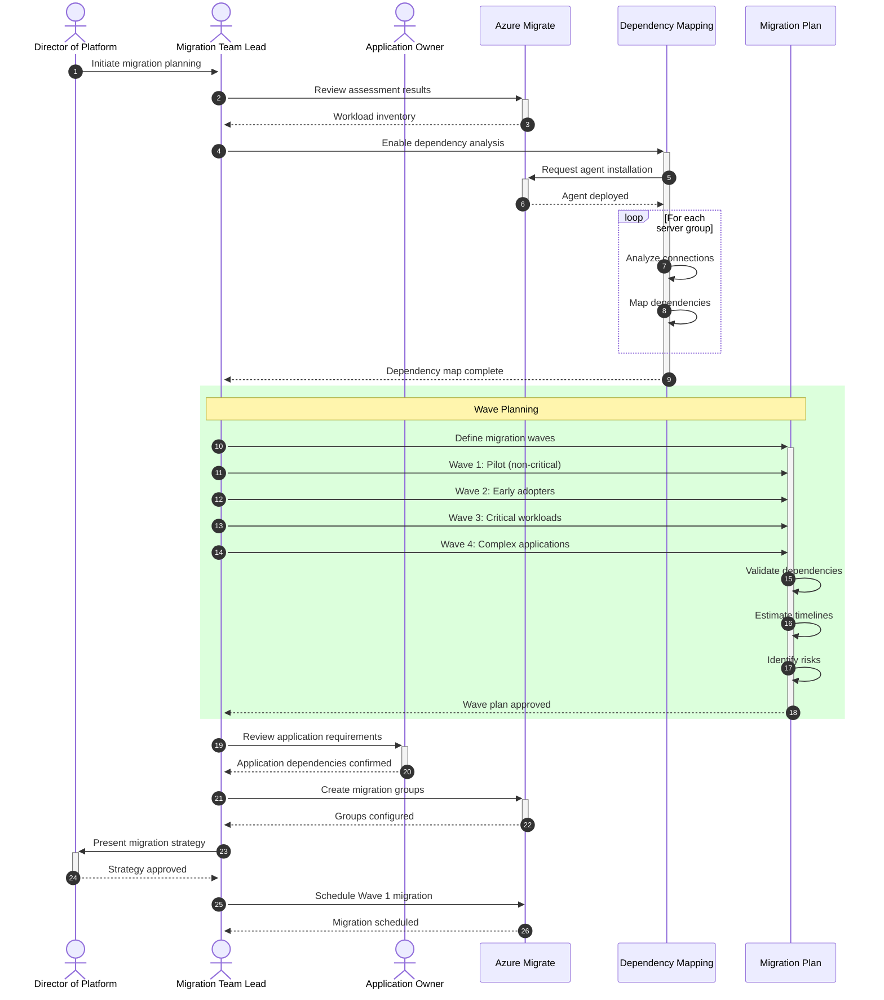
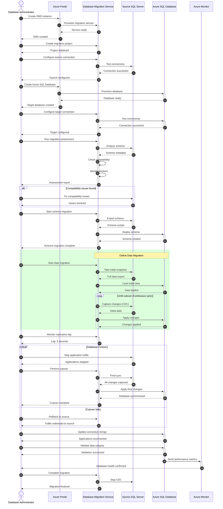
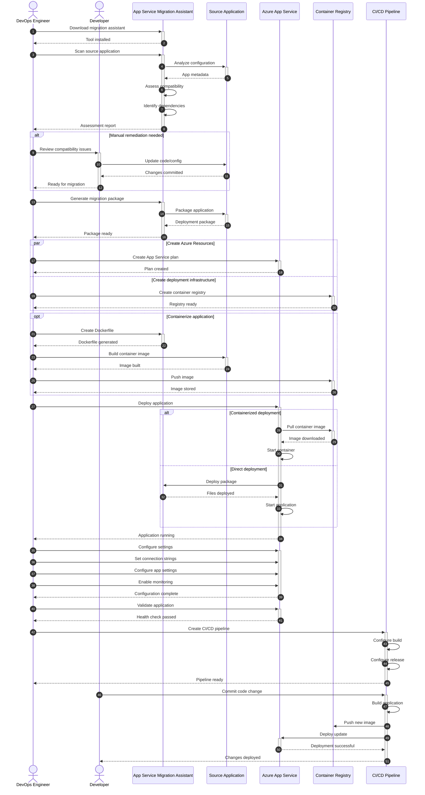
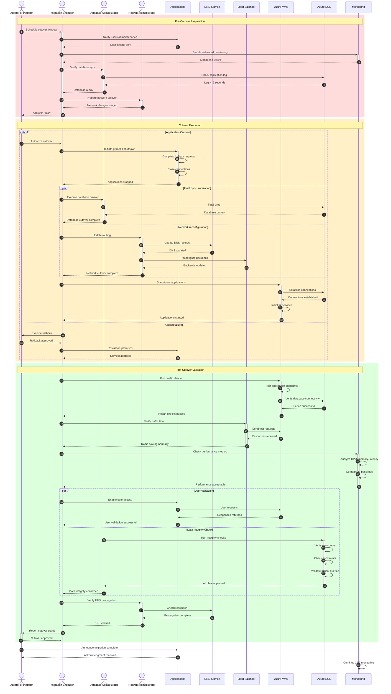
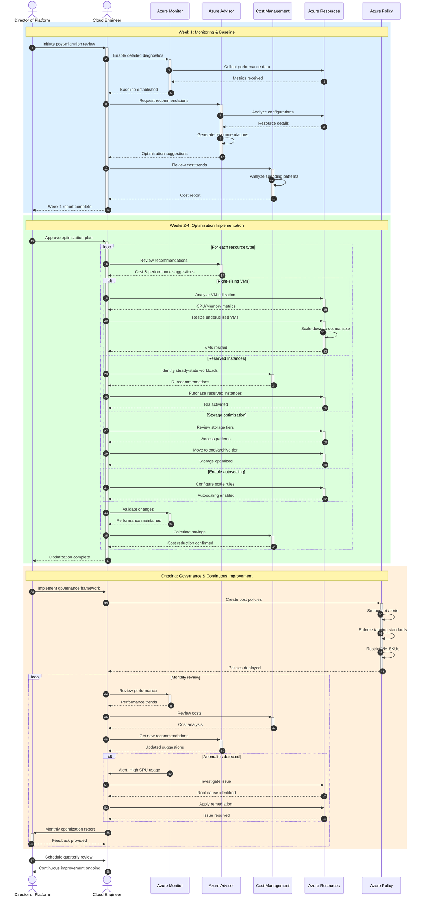

# Azure Cloud Migration Sequence Diagrams

## Overview

This document provides detailed sequence diagrams for the Azure cloud migration process, illustrating the interactions between various components, services, and stakeholders throughout the migration lifecycle.

## Table of Contents

1. [Discovery and Assessment Sequence](#discovery-and-assessment-sequence)
2. [Migration Planning Sequence](#migration-planning-sequence)
3. [Server Migration Sequence](#server-migration-sequence)
4. [Database Migration Sequence](#database-migration-sequence)
5. [Application Migration Sequence](#application-migration-sequence)
6. [Cutover and Validation Sequence](#cutover-and-validation-sequence)
7. [Post-Migration Optimization Sequence](#post-migration-optimization-sequence)

---

## Discovery and Assessment Sequence

This diagram shows the complete discovery and assessment workflow from initial setup to final cost analysis.



**Key Steps:**

1. **Project Setup**: Create Azure Migrate project in Azure Portal
2. **Appliance Deployment**: Download and deploy lightweight discovery appliance
3. **Discovery Configuration**: Connect appliance to on-premises infrastructure
4. **Continuous Discovery**: Automated data collection every 24 hours
5. **Assessment Creation**: Analyze discovered workloads for Azure readiness
6. **Results Review**: Review sizing, costs, and migration recommendations

---

## Migration Planning Sequence

This diagram illustrates the strategic planning process for organizing migration waves and dependencies.



**Key Activities:**

1. **Assessment Review**: Analyze discovered workloads and readiness
2. **Dependency Mapping**: Identify application dependencies and connections
3. **Wave Planning**: Organize workloads into migration waves
4. **Stakeholder Alignment**: Confirm requirements with application owners
5. **Migration Groups**: Create logical groupings for coordinated migration
6. **Strategy Approval**: Get executive sign-off on migration plan

---

## Server Migration Sequence

This diagram shows the detailed process for migrating VMs using Azure Site Recovery.

```mermaid
sequenceDiagram
    autonumber
    actor Engineer as Migration Engineer
    participant Migrate as Azure Migrate
    participant ASR as Azure Site Recovery
    participant Source as Source VMs
    participant Cache as Cache Storage
    participant Target as Azure Target VMs
    participant Monitor as Azure Monitor
    
    Engineer->>+Migrate: Select VMs for migration
    Migrate->>+ASR: Initialize replication
    ASR->>+Source: Install mobility agent
    Source-->>-ASR: Agent installed
    ASR-->>-Migrate: Replication ready
    
    rect rgb(255, 240, 200)
    Note over ASR,Target: Initial Replication
    ASR->>+Source: Start initial sync
    Source->>Cache: Copy disk data
    Cache->>+Target: Transfer to Azure
    Target-->>-Cache: Data received
    Cache-->>Source: Sync complete
    Source-->>-ASR: Initial replication done
    end
    
    rect rgb(200, 240, 255)
    Note over ASR,Target: Delta Replication (Continuous)
    loop Until cutover
        ASR->>+Source: Replicate changes
        Source->>Cache: Send delta data
        Cache->>Target: Apply changes
        Target-->>Cache: Changes applied
        Cache-->>-Source: Delta sync complete
    end
    end
    
    Engineer->>+Migrate: Request test migration
    Migrate->>+ASR: Create test VM
    ASR->>Target: Clone replicated disks
    Target->>Target: Start test VM
    Target-->>ASR: Test VM running
    ASR-->>-Migrate: Test migration complete
    Migrate-->>-Engineer: Test VM ready
    
    Engineer->>+Target: Validate test VM
    Target-->>-Engineer: Validation successful
    
    Engineer->>+Migrate: Cleanup test resources
    Migrate->>ASR: Delete test VM
    ASR-->>Migrate: Test cleanup complete
    Migrate-->>-Engineer: Ready for production migration
    
    critical Production Cutover
        Engineer->>+Migrate: Execute production migration
        Migrate->>+ASR: Initiate failover
        ASR->>Source: Final sync
        Source-->>ASR: All changes synced
        ASR->>Target: Create production VM
        Target->>Target: Boot from replicated disks
        Target-->>ASR: VM online
        ASR-->>-Migrate: Migration complete
        Migrate-->>-Engineer: Production VM ready
    option Failover issues
        Engineer->>Migrate: Rollback to source
        Migrate-->>Engineer: Failback initiated
    end
    
    Engineer->>+Target: Validate production VM
    Target-->>-Engineer: Validation successful
    
    Target->>+Monitor: Send metrics
    Monitor-->>-Engineer: VM health confirmed
    
    Engineer->>+Migrate: Complete migration
    Migrate->>ASR: Stop replication
    ASR-->>Migrate: Replication stopped
    Migrate-->>-Engineer: Migration finalized
```

**Migration Phases:**

1. **Replication Setup**: Install mobility agents and prepare for data sync
2. **Initial Replication**: Full copy of source VM disks to Azure
3. **Delta Replication**: Continuous sync of changes (typically 5-15 min intervals)
4. **Test Migration**: Non-disruptive test failover for validation
5. **Test Validation**: Verify functionality in test environment
6. **Production Cutover**: Final sync and production migration
7. **Validation & Monitoring**: Confirm successful migration and monitor health

---

## Database Migration Sequence

This diagram details the database migration process using Azure Database Migration Service (DMS).



**Migration Steps:**

1. **DMS Setup**: Create and configure Database Migration Service
2. **Connectivity**: Establish connections to source and target databases
3. **Assessment**: Analyze compatibility and identify blockers
4. **Schema Migration**: Migrate database schema to Azure SQL
5. **Initial Data Load**: Full snapshot of source database
6. **Change Data Capture**: Continuous synchronization of changes
7. **Cutover**: Stop applications, final sync, and redirect traffic
8. **Validation**: Verify data integrity and application functionality

---

## Application Migration Sequence

This diagram shows the process for migrating web applications to Azure App Service.



**Application Migration Workflow:**

1. **Assessment**: Analyze application compatibility with Azure App Service
2. **Remediation**: Fix compatibility issues and update dependencies
3. **Package Creation**: Generate deployment package or container image
4. **Resource Provisioning**: Create App Service plan and supporting resources
5. **Containerization** (Optional): Build and store container images
6. **Deployment**: Deploy application to Azure App Service
7. **Configuration**: Set connection strings, app settings, and monitoring
8. **CI/CD Setup**: Establish automated deployment pipeline
9. **Continuous Deployment**: Enable automated updates from source control

---

## Cutover and Validation Sequence

This diagram illustrates the coordinated cutover process for a complete application stack migration.



**Cutover Phases:**

1. **Pre-Cutover Preparation**
   - Schedule maintenance window
   - Verify replication status
   - Enable enhanced monitoring
   - Stage network changes

2. **Cutover Execution**
   - Gracefully stop on-premises applications
   - Perform final database synchronization
   - Update DNS and load balancer configuration
   - Start Azure applications

3. **Post-Cutover Validation**
   - Run automated health checks
   - Verify traffic flow and connectivity
   - Check performance metrics
   - Validate data integrity
   - Confirm DNS propagation
   - Enable user access

---

## Post-Migration Optimization Sequence

This diagram shows the continuous optimization process after successful migration.



**Optimization Phases:**

1. **Week 1: Monitoring & Baseline**
   - Enable detailed diagnostics
   - Establish performance baselines
   - Request Azure Advisor recommendations
   - Review initial cost trends

2. **Weeks 2-4: Optimization Implementation**
   - Right-size VMs based on actual utilization
   - Purchase Reserved Instances for predictable workloads
   - Optimize storage tiers (Hot/Cool/Archive)
   - Enable autoscaling for variable workloads
   - Apply Azure Hybrid Benefit for licensing

3. **Ongoing: Governance & Continuous Improvement**
   - Deploy Azure Policy for cost controls
   - Set budget alerts and spending limits
   - Enforce tagging and naming standards
   - Monthly performance and cost reviews
   - Quarterly strategic optimization planning

---

## Best Practices for Migration Execution

### Communication
- Maintain clear communication channels with all stakeholders
- Provide regular status updates during migration
- Document all changes and decisions
- Establish escalation procedures for issues

### Testing
- Always perform test migrations before production cutover
- Validate functionality in Azure environment
- Test disaster recovery procedures
- Conduct performance testing under load

### Rollback Planning
- Define clear rollback criteria
- Document rollback procedures
- Keep source systems operational during validation period
- Test rollback procedures before cutover

### Monitoring
- Enable enhanced monitoring during migration
- Set up alerting for critical metrics
- Monitor both source and target environments
- Track migration progress and performance

### Documentation
- Document current state architecture
- Record all migration steps
- Capture configuration changes
- Update runbooks and operational procedures

---

## Related Documentation

- [Reference Architecture](./reference-architecture.md)
- [Best Practices Guide](./best-practices.md)
- [Migration Execution Phase](./04-migration-execution.md)
- [Azure MCP Migration Tools](./azure-mcp-migration-tools.md)

---

**Document Version**: 1.0  
**Last Updated**: November 12, 2025  
**Process Standard**: Azure Migration Best Practices
